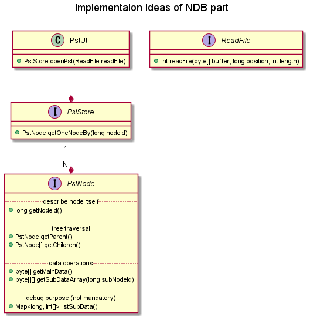
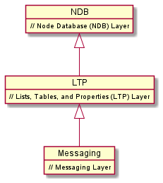

# ruby-msg-nx

[](https://dev.azure.com/HiraokaHyperTools/ruby-msg/_build/latest?definitionId=12&branchName=dev)
[](https://rubygems.org/gems/ruby-msg-nx)

_Quick links_: [Home](https://hiraokahypertools.github.io/ruby-msg/) | [yard](https://hiraokahypertools.github.io/ruby-msg/doc/index.html)

This is a private fork of https://github.com/aquasync/ruby-msg repository.

## Birds eye view of PST file structure



Notes:

- `nodeId` is unique number in pst file.
  - There are some known `nodeId`s from Outlook. For example `290` is useful to obtain top_node in both pst and ost file.
- PstNode consists from tree structure. 
  - There is zero or one parent.
  - There are zero, one or many children.
  - There may be one or some root nodes (having no parent).
- `PstNode` is application unaware structure.
  - Outlook uses pst and ost to store mail folders and items like mail, contact and so on.
  - `mainData` represents usually RawPropertyStore. It is simply _key,type=value_ pairs.
  - `subDataArray` represents collection objects like attachment files, recipients and so on.
  - Each `byte[]` length ranges from 0 to 8176. It cannot exceed 8176 bytes. This comes from PST limitation.

mainData sample as RawPropertyStore:

- mainData may or may not represent RawPropertyStore.
- RawProperty format is `{(key and type), value)}`.
- For example `{(001a001f), IPM.Note)}` means:
  - propertyId = _0x001a_
  - dataType = _0x001f_ (PT_UNICODE)
  - value = `IPM.Note`
  - This is _PidTagMessageClass_.
  - See also: [PidTagMessageClass Canonical Property | Microsoft Docs](https://docs.microsoft.com/en-us/office/client-developer/outlook/mapi/pidtagmessageclass-canonical-property)
- RawPropertyStore is `Property Context (PC)`. See also: [[MS-PST]: Property Context (PC) | Microsoft Docs](https://docs.microsoft.com/en-us/openspecs/office_file_formats/ms-pst/294c83c6-ff92-42f5-b6b6-876c29fa9737)

```
{(0002000b), True)}
{(00170003), 1)}
{(001a001f), IPM.Note)}
{(0023000b), False)}
{(00260003), 0)}
{(0029000b), False)}
{(00360003), 0)}
{(0037001f), PDFs)}
{(0070001f), PDFs)}
{(00710102), System.Byte[])}
{(0e01000b), False)}
{(0e060040), System.Byte[])}
{(0e070003), 25)}
{(0e080003), 6361419)}
{(1000001f), 「日本型食生活」のススメ)}
{(10130102), System.Byte[])}
{(10800003), 4294967295)}
{(30070040), System.Byte[])}
{(30080040), System.Byte[])}
{(300b0102), System.Byte[])}
{(3fde0003), 50220)}
{(3ff10003), 1041)}
{(6619001f), 「日本型食生活」のススメ)}
{(80100003), 0)}
{(8016000b), False)}
{(80210003), 155399)}
{(8049001f), 15.0)}
{(804a000b), False)}
{(804b0003), 0)}
{(8053000b), False)}
{(80560003), 0)}
{(80900040), System.Byte[])}
{(80930102), System.Byte[])}
{(80940102), System.Byte[])}
{(80b00003), 1041)}
```

subDataArray sample:

Each subDataArray is identified by _subNodeId_.

Legend: `0x0671, 1, 1662` means

- subNodeId = 0x0671
- numberOfSubDataArray = 1
- totalBytesOfSubData = 1662

```
PDFs {
    subData(0x0671, 1, 1662), 
    subData(0x8285, 1, 370), 
    subData(0x87bf, 1, 3512), 
    subData(0x82a5, 1, 370), 
    subData(0x87ff, 1, 3512), 
    subData(0x82c5, 1, 370), 
    subData(0x883f, 1, 3512), 
    subData(0x82e5, 1, 370), 
    subData(0x887f, 1, 3512), 
    subData(0x8305, 1, 334), 
    subData(0x88bf, 1, 3512), 
    subData(0x88df, 1, 3134)
}
```

- subData `0x671` must exist, if the message has one or more _attachment files_. See also: [[MS-PST]: Attachment Table Template | Microsoft Docs](https://docs.microsoft.com/en-us/openspecs/office_file_formats/ms-pst/47c336f7-2d9b-4f22-91c7-5bb422aaebbb)
- subData `0x692` must exist, if the message has one or more _recipient entries_. See also: [[MS-PST]: Recipient Table Template | Microsoft Docs](https://docs.microsoft.com/en-us/openspecs/office_file_formats/ms-pst/bb069b2b-80ad-46d5-b86f-33487d16bf0c)

## PST layers

PST is formatted in multi layerd structure.

The above overview represents implementaion ideas of NDB part.



See also:

NDB:

- [[MS-PST]: Node Database (NDB) Layer | Microsoft Docs](https://docs.microsoft.com/en-us/openspecs/office_file_formats/ms-pst/e4efaad0-1876-446e-9d34-bb921588f924)
- [[MS-PST]: NDB Layer | Microsoft Docs](https://docs.microsoft.com/en-us/openspecs/office_file_formats/ms-pst/cf7df7ba-f925-459f-b643-6431ec953124)

LTP:

- [[MS-PST]: Lists, Tables, and Properties (LTP) Layer | Microsoft Docs](https://docs.microsoft.com/en-us/openspecs/office_file_formats/ms-pst/4c24c7d2-5c5a-4b99-88b2-f4b84cc293ae)
- [[MS-PST]: LTP Layer | Microsoft Docs](https://docs.microsoft.com/en-us/openspecs/office_file_formats/ms-pst/77007716-7993-44fe-9b40-9526157cfc6d)

Messaing:

- [[MS-PST]: Lists, Tables, and Properties (LTP) Layer | Microsoft Docs](https://docs.microsoft.com/en-us/openspecs/office_file_formats/ms-pst/4c24c7d2-5c5a-4b99-88b2-f4b84cc293ae)
- [[MS-PST]: Messaging Layer | Microsoft Docs](https://docs.microsoft.com/en-us/openspecs/office_file_formats/ms-pst/e2e7a5aa-c89f-4fb8-b044-15ac76e5207e)


